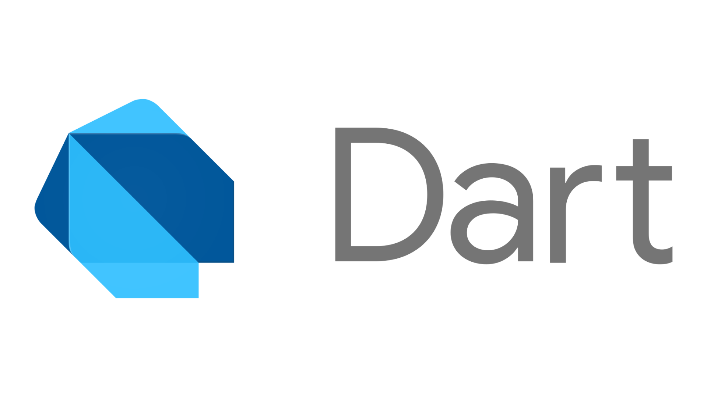

# Basic of Dart



This is a some basic code of Dart. Dart is a programming language developed by Google. Dart is designed to build high-performance applications on various platforms, including web, mobile, and desktop. This code is consist of the basic syntax and features of Dart.

## 1. Why use Dart?

Dart as a programming language, offers several advantages that make it appealing for application development:

- <b>High Performance</b>: Dart is compiled into machine code, enabling it to run very fast.
- <b>Single Codebase</b>: Dart enables developers to develop applications for multiple platforms such as web, mobile, or desktop using the same codebase.
- <b>Flexibility</b>: Dart supports both object-oriented programming and functional programming paradigms.
- <b>Rich Libraries</b>: Dart has a wide ecosystem of libraries to supports any Dart user.

## 2. Dart Installation

You can install the Dart by visiting the official Dart website at [dart.dev](https://dart.dev/get-dart). Follow the provided instructions for your operating system.

## 3. Dart Basic Main Code

```dart
  void main() {
     print("Hello World!")
  }
```

- Every Dart program starts with main() function and must have a main() function.
- Every Dart program starts with main() function and must have a main() function.
